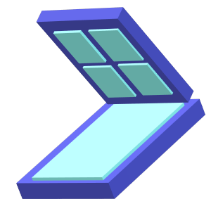

# Skylight
A composable high level window library for F# and WPF to explore using Computation Expression UI



## Summary
Skylight is a basic, proof of concept library built on top of WPF and F# Computation Expressions to allow building of composable UI for windows.

The model is a hybrid of both MVVM and Elmish MVU, where a model is mapped into a view like MVU, but it is only done once on the initial render, with all subsequent updates propegating through targeted bindings. The targeted updates of model properties requires the model to be mutable, and the targets are defined using FSharp Quotations eg `<@ model.Property @>`

In order to an update properties, and ensure they pass through the binding infrastrucutre, properties are never set directly like `model.Property <- value` as this will only update the model, not propegate it through the UI. All binding/mapping functions will allow you to return a value, and this will set the target property given by a FSharp Quotation `(<@ model.Prop @>,fun () -> "myValue")`
to allow multiple updates, there are overloads for these funtions eg `<@ model.P1 @>,<@ model.P2 @>,fun () -> "P1Value" , "P2Value")` 

## The Model
We define our model with F# records like:
```f#
type Person = {
    mutable Name : string
    mutable Age : int
    mutable Address : string
}
```
Now that we have a model, we can deifine our view
```f#
let mainView model =
    stackpanel {
        children [
            label { content <@ model.Name @> }
            label { content (<@ model.Age @>,fun ()-> string model.Age }
            label { content <@ model.Address @> }
        ]
    }
```
UI elements are created with computation expression builders, and thier properties are set or bound using the builders operations.